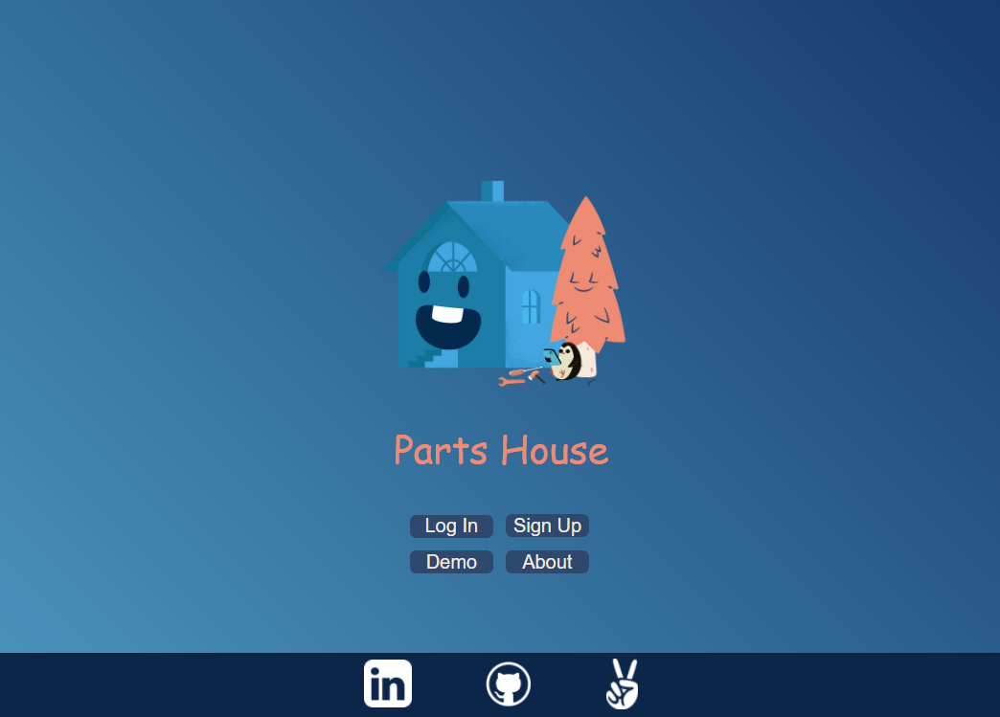
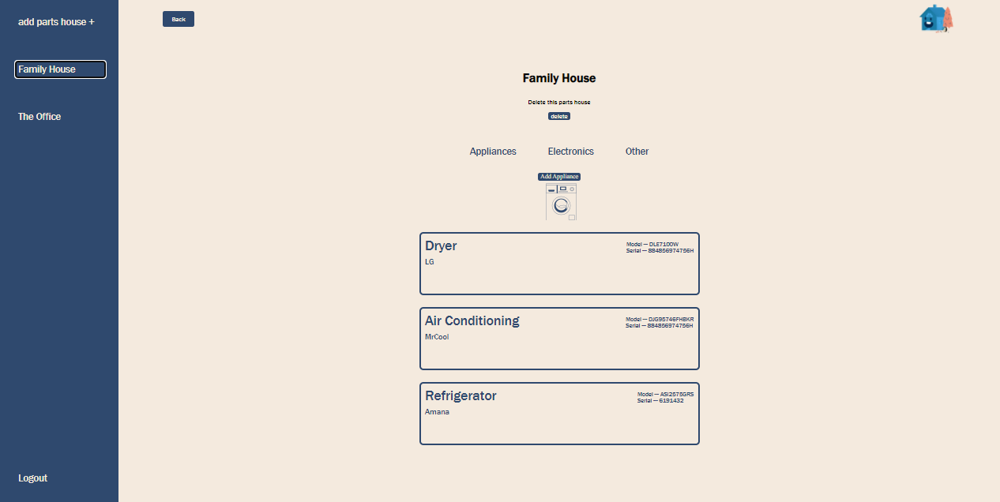
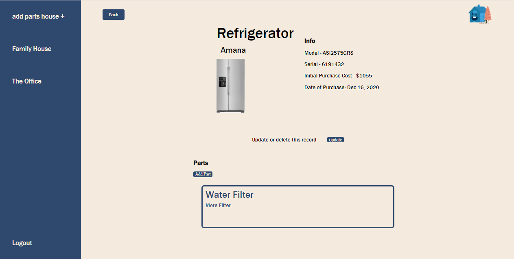
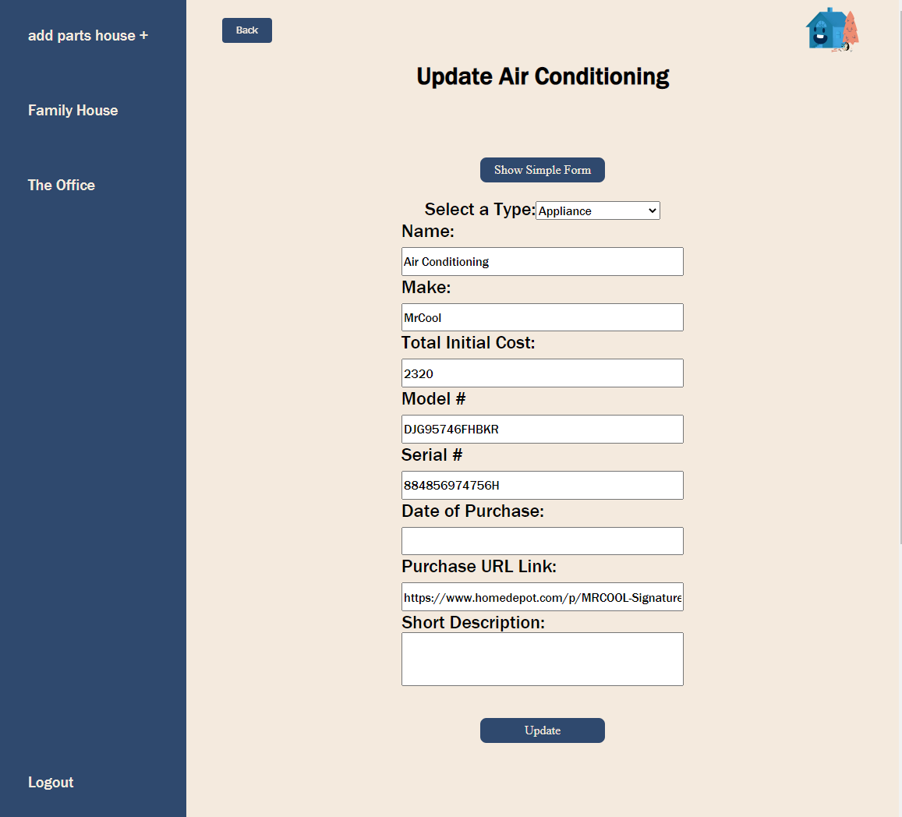
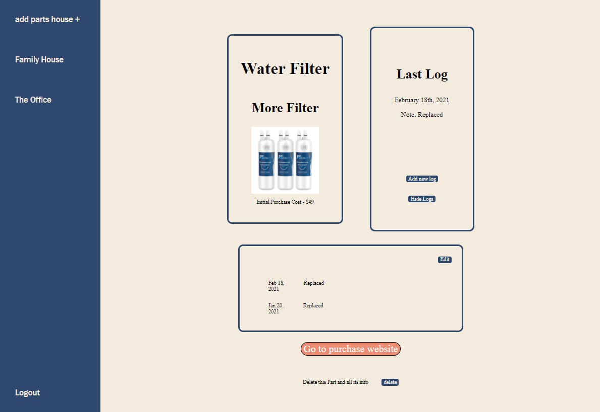
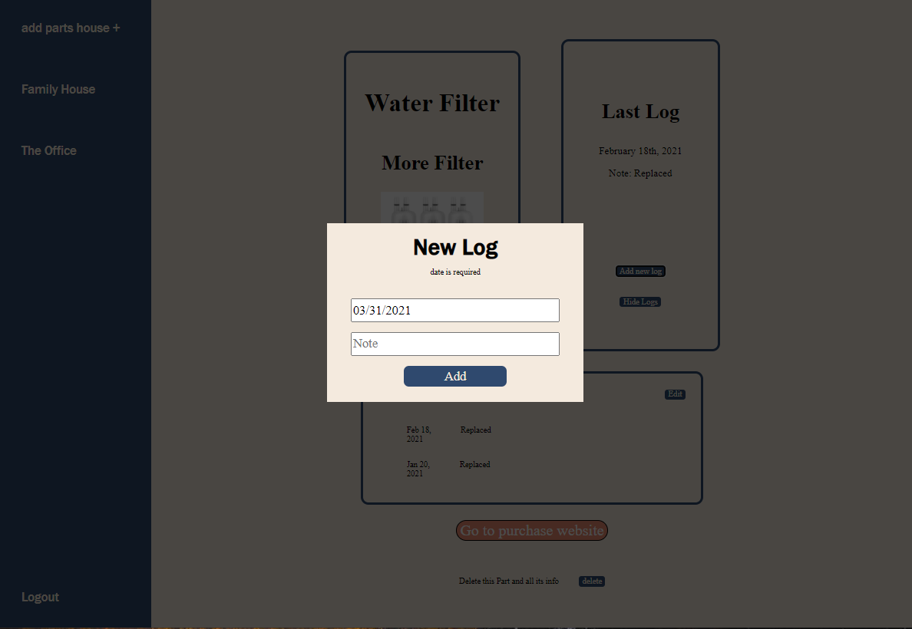
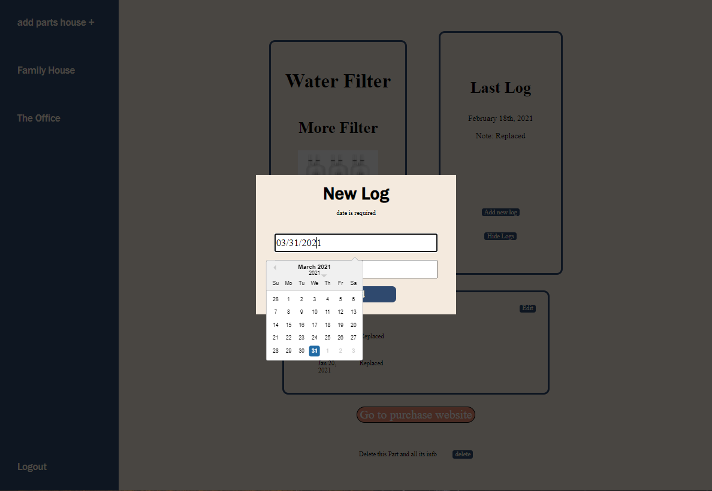

# PartsHouse

## Table of Contents

1. [Introduction](#introduction)
2. [Dependencies](#technologies)
3. [Features](#features)
4. [Routes](#routes)

## Introduction

Hello, Welcome to Parts House.
Parts House is your very own customizable parts tracker, where you can record valuable info of individual parts from your appliances and/or electronics. Save model/serial numbers, logs when an asset was installed, record date of purchase, and even save where to re-purchase these items when you need to.

## Technologies

- Heroku
- Node
- PostGreSQL
- Express Server
- Sequelize
- React
- Redux

## Features

 ### Hosting on Heroku
	 Hosted on a live dependable server

 ### Sign-Up, Login, Demo, and About
	A function integrated into the splash page that will allow the user to login, sign-up, use a demo version the site, or read an about section.

 ### User Parts House
 -	Registered users have access to a user-parts-house page, which contains a side NavBar with all necessary tools and ability to view owned items.
	
 ### Records Display
 -	An organized and friendly display of user records for assets categorized by appliances, electronics, and other.

 ### Records Page
 -	Individual Records have their own page with the ability to save and update model/serial numbers, date of purchase, and list of associated parts.

  
 ### Part Page and Logs
 - 	On Part Page, user can save a log of specific date and note when part has been changed or updated.
 - 	Logs can be hidden or viewed

  
 ### Save Part Purchase Link
-	  User can save the URL of product page for future re-puchase.

## Routes
 
 Pages
 
 - Splash Page ("/")
 - About Page ("/about")
 - SignUp Page ("/singup")
 - Default Page ("/users/:userId")  
 
 - Appliances ("/parts-house/:partsHouseId/appliances")
 - Electronics ("/parts-house/:partsHouseId/electronics")
 - Other ("/parts-house/:partsHouseId/other")  
 
 - Record Page ("/records/:recordId")
 - Add Record Page ("/parts-house/:partsHouseId/records/add-record-page")
 - PartPage ("/parts/:partId")
 - Update Record Page ("/records/:recordIs/update-record-page")
 - Add Part Page ("/records/:recordId/parts/add-part-page")  
  
 ### API  
  
 - Users 
  	- GET ("/")
  	- GET ("/:userId/partshouses")  
   
 - Partshouses
 	- POST ("/create")
 	- DELETE("/:partsHouseId/delete")
 	- GET ("/:partsHouseId/records")  
  
- Records
	- GET ("/:recordId")
 	- POST ("/create")
 	- PUT ("/:recordId/update")
 	- DELETE ("/:recordId/delete")
 	- GET ("/:recordId/parts")  
  
 - Parts
  	- GET ("/:partId")
	- POST ("/create")
	- DELETE ("/:partId/delete")
	- GET ("/:partId/logs")
	- POST ("/:partId/logs/create")
	- DELETE ("/logs/:logId/delete")  
 
